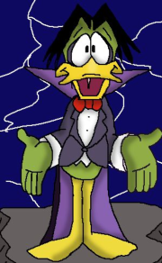

# quack_quack

## pseudo code with syntax highlighting from R Markdown and Prism.js

read this blog post from Charles T. Gray http://cantabile.rbind.io/2018/06/26/quack-quack-environment/

The project involves some R Markdown chunk tricks and a customized version of the Prism.js syntax highlighter for R.

View a perview of the knitted htlm file here.

**Help wanted** : customizing RStudio syntax highlighting to display the quack_quack syntax natively in .Rmd filesin the RStudio editor

